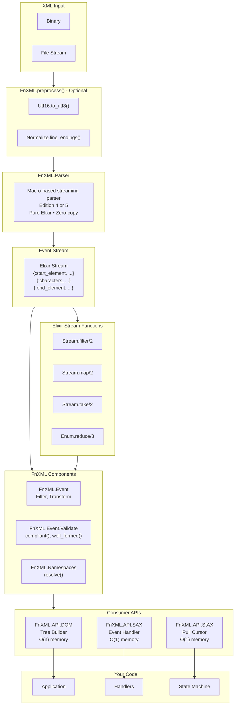

# FnXML

**A streaming XML library for Elixir built on Elixir Streams.**

## What is FnXML?

FnXML is a pure Elixir XML processing library that parses XML into **lazy streams of events**. These event streams flow through a **composable pipeline of components**, allowing you to build exactly the XML processing pipeline you need—no more, no less.

### Built on Elixir Streams

**Event streams are the basic format.** FnXML parses XML directly into Elixir Streams, which means **all Elixir stream tools work with XML**:

```elixir
FnXML.Parser.parse(xml)
|> Stream.filter(fn {:start_element, tag, _, _, _, _} -> tag == "book"; _ -> false end)
|> Stream.take(10)                    # Take first 10 books
|> Stream.map(&process_event/1)       # Transform events
|> Stream.chunk_every(5)              # Batch processing
|> Enum.reduce(acc, &reducer/2)       # Aggregate results
```

This provides:

- **Lazy evaluation** - Parse only what you consume, stop early when you find what you need
- **Constant memory** - Process multi-gigabyte files with O(1) memory usage
- **Composable pipelines** - Connect components together with the pipe operator
- **Backpressure** - Slow consumers automatically slow the parser
- **Natural integration** - Use `Stream.filter`, `Stream.map`, `Stream.take`, `Enum.reduce`, etc.

### Simple: Full Compliant Processing

For fully XML 1.0 compliant processing, use `FnXML.process/1`:

```elixir
# Process a string
FnXML.process("<root><child>text</child></root>")
|> Enum.to_list()

# Process a file
File.stream!("data.xml")
|> FnXML.process()
|> FnXML.API.DOM.build()
```

`FnXML.process/1` applies the complete pipeline: preprocessing (UTF-16, line endings), parsing, XML 1.0 validation, and DTD/namespace resolution.

### Granular: Build Your Own Pipeline

For more control, compose individual components:

```elixir
File.stream!("data.xml")
|> FnXML.preprocess()                      # Preprocess: UTF-16 + line endings
|> FnXML.Parser.parse()                    # Parse XML to event stream
|> FnXML.Event.Filter.filter_ws()          # Filter whitespace events
|> FnXML.Event.Validate.compliant()        # Full XML 1.0 validation (optional)
|> FnXML.Event.resolve()                   # DTD + namespace resolution (optional)
|> Stream.filter(&my_filter/1)             # Your custom filters
|> Enum.reduce(acc, &my_reducer/2)         # Process events
```

**Use only what you need.** Each component is optional—skip validation for trusted input, skip namespace resolution if not using namespaces, add custom filters using standard Elixir Stream functions.

### XML APIs: DOM, SAX, StAX

For developers familiar with traditional XML APIs, FnXML also provides standard DOM, SAX, and StAX interfaces. These are built on top of the event stream:

- **DOM (Tree)** - `FnXML.API.DOM` - Build an in-memory tree for small-to-medium documents with random access
- **SAX (Push)** - `FnXML.API.SAX` - Process events with callbacks for large documents
- **StAX (Pull)** - `FnXML.API.StAX` - Pull events on-demand with a cursor for complex state machines

```elixir
events = FnXML.Parser.parse(xml)

# Traditional XML APIs (all built on event streams)
doc = events |> FnXML.API.DOM.build()                           # DOM
{:ok, result} = events |> FnXML.API.SAX.dispatch(Handler, state) # SAX
reader = events |> FnXML.API.StAX.Reader.new()                  # StAX

# Or use the stream directly with Elixir tools (recommended)
results = events
|> Stream.filter(&filter_func/1)
|> Enum.map(&process_func/1)
```

## Architecture



**Key Concepts:**
- **Preprocessors** - `FnXML.Preprocess.*` operates on binaries before parsing (UTF-16, line endings)
- **Event streams are the basic format** - Use Elixir's Stream and Enum modules directly
- **FnXML.Event is the standard API** - Provides stream transformations and filters for events
- **DOM/SAX/StAX are alternative APIs** - For traditional XML processing patterns
- **Component-based** - Connect only the components you need

## Quick Start

```elixir
# Fully compliant processing (recommended)
events = FnXML.process("<root><child id=\"1\">Hello</child></root>")
|> Enum.to_list()

# Build DOM tree
doc = FnXML.process("<root><child id=\"1\">Hello</child></root>")
      |> FnXML.API.DOM.build()
doc.root.tag  # => "root"

# SAX callback-based parsing
defmodule CountHandler do
  use FnXML.API.SAX.Handler
  def start_element(_uri, _local, _qname, _attrs, count), do: {:ok, count + 1}
end
{:ok, 2} = FnXML.process("<root><child/></root>")
           |> FnXML.API.SAX.dispatch(CountHandler, 0)

# StAX pull-based parsing
reader = FnXML.process("<root attr=\"val\"/>")
         |> FnXML.API.StAX.Reader.new()
reader = FnXML.API.StAX.Reader.next(reader)
FnXML.API.StAX.Reader.local_name(reader)  # => "root"
FnXML.API.StAX.Reader.attribute_value(reader, nil, "attr")  # => "val"
```

## Installation

```elixir
def deps do
  [{:fnxml, "~> 0.1.0"}]
end
```

## Streaming Architecture

FnXML uses a **lazy streaming architecture** where XML documents are processed as a stream of events rather than being loaded entirely into memory. This approach provides several key benefits:

### Event Stream Model

XML documents flow through the system as a lazy stream of events:

```elixir
# Each XML construct becomes an event tuple
"<root><child>text</child></root>"
  ↓
[
  {:start_document, nil},
  {:start_element, "root", [], 1, 0, 1},
  {:start_element, "child", [], 1, 6, 7},
  {:characters, "text", 1, 13, 14},
  {:end_element, "child", 1, 18, 19},
  {:end_element, "root", 1, 26, 27},
  {:end_document, nil}
]
# Position: line (1-based), line_start_offset, absolute_byte_position
```

### Key Advantages

**1. Constant Memory Usage**

Process files of any size with O(1) memory by consuming events one at a time:

```elixir
# Process a 10GB XML file with minimal memory
File.stream!("huge.xml", [], 65_536)
|> FnXML.Parser.parse()
|> Stream.filter(fn {:start_element, tag, _, _, _, _} -> tag == "record"; _ -> false end)
|> Stream.take(100)
|> Enum.to_list()
# Only the 100 matching records are kept in memory
```

**2. Composable Transformations**

Build processing pipelines by composing stream transformations:

```elixir
File.stream!("data.xml")
|> FnXML.preprocess()                          # Normalize encoding/line endings
|> FnXML.Parser.parse()                        # Parse to events
|> FnXML.Event.Validate.compliant()            # Full XML 1.0 validation
|> FnXML.Event.resolve()                       # Resolve DTD + namespaces
|> FnXML.Event.Filter.filter_ws()              # Remove whitespace
|> FnXML.API.SAX.dispatch(Handler, state)      # Process with handler
```

Each transformation is lazy - it only processes events as they're requested downstream.

**3. Early Termination**

Stop processing as soon as you find what you need:

```elixir
# Find the first user with id=123, then stop parsing
FnXML.Parser.parse(large_xml)
|> Stream.drop_while(fn
  {:start_element, "user", attrs, _, _, _} ->
    not Enum.any?(attrs, fn {k, v} -> k == "id" and v == "123" end)
  _ -> true
end)
|> Stream.take(1)
|> Enum.to_list()
# Parser stops immediately after finding the match
```

**4. Backpressure Support**

Stream processing naturally provides backpressure - the parser only generates events as fast as consumers can process them:

```elixir
# Slow consumer automatically slows down the parser
FnXML.Parser.parse(xml)
|> Stream.each(fn event ->
  # Expensive operation (database write, API call, etc.)
  process_slowly(event)
  Process.sleep(100)
end)
|> Stream.run()
# Parser waits for each event to be processed before generating the next
```

**5. Multiple API Styles**

The event stream can be consumed in different ways depending on your needs:

- **DOM:** Collect all events into an in-memory tree (O(n) memory)
- **SAX:** Process events with callbacks as they arrive (O(1) memory)
- **StAX:** Pull events on demand with a cursor (O(1) memory)
- **Raw Stream:** Direct stream manipulation with Elixir's Stream functions

```elixir
events = FnXML.Parser.parse(xml)

# Option 1: Build DOM tree
doc = events |> FnXML.API.DOM.build()

# Option 2: SAX callbacks
{:ok, result} = events |> FnXML.API.SAX.dispatch(Handler, initial_state)

# Option 3: StAX cursor
reader = events |> FnXML.API.StAX.Reader.new()

# Option 4: Raw stream operations
filtered = events
|> Stream.filter(fn {:characters, _, _, _, _} -> true; _ -> false end)
|> Enum.map(fn {:characters, text, _, _, _} -> text end)
```

### Chunk Boundary Handling

FnXML correctly handles XML elements that span chunk boundaries in streamed input:

```elixir
# Even if <element> starts in one chunk and ends in another, it's parsed correctly
File.stream!("file.xml", [], 1024)  # Small chunks
|> FnXML.Parser.parse()
|> Enum.to_list()
# All elements are correctly parsed regardless of chunk boundaries
```

The parser maintains continuation state to handle incomplete elements across chunk boundaries transparently.

## APIs

### DOM (Document Object Model)

Build an in-memory tree representation. Best for small-to-medium documents where you need random access.

```elixir
# Parse with pipeline
doc = FnXML.Parser.parse("<root><child id=\"1\">text</child></root>")
      |> FnXML.API.DOM.build()

# With full validation and resolution
doc = File.stream!("large.xml")
      |> FnXML.preprocess()
      |> FnXML.Parser.parse()
      |> FnXML.Event.Validate.compliant()
      |> FnXML.Event.resolve()
      |> FnXML.API.DOM.build()

# Navigate
doc.root.tag                                    # => "root"
doc.root.children                               # => [%Element{...}]
FnXML.API.DOM.Element.get_attribute(elem, "id")     # => "1"

# Serialize
FnXML.API.DOM.to_string(doc)                        # => "<root>..."
FnXML.API.DOM.to_string(doc, pretty: true)          # => formatted XML

# Build programmatically
alias FnXML.API.DOM.Element
elem = Element.new("div", [{"class", "container"}], ["Hello"])
```

### SAX (Simple API for XML)

Push-based event callbacks. Best for large documents where you only need specific data.

```elixir
defmodule MyHandler do
  use FnXML.API.SAX.Handler

  @impl true
  def start_element(_uri, local_name, _qname, _attrs, state) do
    {:ok, [local_name | state]}
  end

  @impl true
  def characters(text, state) do
    {:ok, Map.update(state, :text, text, &(&1 <> text))}
  end

  @impl true
  def end_document(state) do
    {:ok, Enum.reverse(state)}
  end
end

# Pipeline style (recommended)
{:ok, result} = FnXML.Parser.parse(xml)
                |> FnXML.API.SAX.dispatch(MyHandler, [])

# With full validation
{:ok, result} = File.stream!("large.xml")
                |> FnXML.preprocess()
                |> FnXML.Parser.parse()
                |> FnXML.Event.Validate.compliant()
                |> FnXML.API.SAX.dispatch(MyHandler, [])
```

**Callbacks:** `start_document/1`, `end_document/1`, `start_element/5`, `end_element/4`, `characters/2`

**Return values:** `{:ok, state}`, `{:halt, state}` (stop early), `{:error, reason}`

### StAX (Streaming API for XML)

Pull-based cursor navigation. Best for large documents with complex processing logic.

```elixir
# Pipeline style (recommended)
reader = FnXML.Parser.parse(xml)
         |> FnXML.API.StAX.Reader.new()

# With full validation
reader = File.stream!("large.xml")
         |> FnXML.preprocess()
         |> FnXML.Parser.parse()
         |> FnXML.Event.Validate.compliant()
         |> FnXML.API.StAX.Reader.new()

# Pull events one at a time (lazy - O(1) memory)
reader = FnXML.API.StAX.Reader.next(reader)

# Query current event
FnXML.API.StAX.Reader.event_type(reader)      # => :start_element
FnXML.API.StAX.Reader.local_name(reader)      # => "root"
FnXML.API.StAX.Reader.attribute_count(reader) # => 2
FnXML.API.StAX.Reader.attribute_value(reader, nil, "id")  # => "123"

# Convenience methods
FnXML.API.StAX.Reader.start_element?(reader)  # => true
FnXML.API.StAX.Reader.has_next?(reader)       # => true
{text, reader} = FnXML.API.StAX.Reader.element_text(reader)  # read all text in element
```

**Writer for building XML:**

```elixir
xml = FnXML.API.StAX.Writer.new()
|> FnXML.API.StAX.Writer.start_document()
|> FnXML.API.StAX.Writer.start_element("root")
|> FnXML.API.StAX.Writer.attribute("id", "1")
|> FnXML.API.StAX.Writer.characters("Hello")
|> FnXML.API.StAX.Writer.end_element()
|> FnXML.API.StAX.Writer.to_string()
# => "<?xml version=\"1.0\"?><root id=\"1\">Hello</root>"
```

### Low-Level Stream API

Direct access to the event stream for custom processing.

```elixir
# Parse XML string to event stream
"<root><child/></root>"
|> FnXML.Parser.parse()
|> Enum.to_list()
# => [{:start_document, nil}, {:start_element, "root", [], 1, 0, 1}, ...]

# Parse file stream (64KB chunks, lazy evaluation)
File.stream!("large.xml", [], 65536)
|> FnXML.Parser.parse()
|> Enum.to_list()

# Force specific parser backend
FnXML.Parser.parse(xml, parser: :fast)     # Fast parser (no position tracking)
FnXML.Parser.parse(xml, parser: :legacy)   # Legacy parser

# Direct access to legacy block parsers
events = FnXML.Legacy.ExBlkParser.parse("<root/>")
events = FnXML.Legacy.FastExBlkParser.parse("<root/>")

# With namespace resolution
FnXML.Parser.parse("<root xmlns=\"http://example.org\"><child/></root>")
|> FnXML.Namespaces.resolve()
|> Enum.to_list()
# => [{:start_element, {"http://example.org", "root"}, [...], ...}, ...]

# Convert stream to XML
xml = events |> FnXML.Event.to_iodata() |> Enum.join()
```

**Parser Options:**
- `:parser` - Select parser: `:default` (Edition 5), `:fast` (no position tracking), or `:legacy` (ExBlkParser)
- `:edition` - XML 1.0 edition: 4 (strict) or 5 (permissive, default)

**Event types (W3C StAX-compatible):**
- `{:start_element, tag, attrs, location}` - Start element
- `{:end_element, tag}` or `{:end_element, tag, location}` - End element
- `{:characters, content, location}` - Text content
- `{:comment, content, location}` - Comment
- `{:cdata, content, location}` - CDATA section
- `{:prolog, "xml", attrs, location}` - XML declaration
- `{:processing_instruction, target, data, location}` - Processing instruction

### Custom Parsers

Create specialized parser modules with compile-time event filtering for improved performance:

```elixir
# Define a custom parser that skips whitespace and comments
defmodule MyApp.MinimalParser do
  use FnXML.Parser.Generator,
    edition: 5,
    disable: [:space, :comment]
end

# Use your custom parser
MyApp.MinimalParser.parse("<root>text</root>")
|> Enum.to_list()
# => Only structure and content events, no whitespace or comments
```

**Generator Options:**
- `:edition` - Required. XML 1.0 edition (4 or 5)
- `:disable` - List of event types to skip:
  - `:space` - Whitespace-only text nodes
  - `:comment` - XML comments
  - `:cdata` - CDATA sections
  - `:prolog` - XML declarations
  - `:characters` - Text content
  - `:processing_instruction` - Processing instructions
- `:positions` - Position tracking:
  - `:full` (default) - Line, column, and byte offset
  - `:line_only` - Only line numbers
  - `:none` - No position data (fastest)

**Example Parsers:**

```elixir
# Structure-only parser (elements only)
defmodule StructureParser do
  use FnXML.Parser.Generator,
    edition: 5,
    disable: [:characters, :space, :comment, :cdata]
end

# Fast parser (no position tracking)
defmodule FastParser do
  use FnXML.Parser.Generator,
    edition: 5,
    positions: :none
end
```

**Runtime Access:**

Get pre-built parser modules at runtime:

```elixir
# Get Edition 5 parser
parser = FnXML.Parser.generate(5)
parser.parse("<root/>")

# Get Edition 4 parser (strict character validation)
parser = FnXML.Parser.generate(4)
```

### Saxy Compatibility

For codebases using Saxy's SimpleForm format:

```elixir
# Decode to SimpleForm tuple
{"root", attrs, children} = FnXML.Event.Transform.Stream.SimpleForm.decode("<root><child/></root>")

# Encode back to XML
FnXML.Event.Transform.Stream.SimpleForm.encode({"root", [], ["text"]})

# Convert between SimpleForm and DOM
elem = FnXML.Event.Transform.Stream.SimpleForm.to_dom({"root", [{"id", "1"}], ["text"]})
tuple = FnXML.Event.Transform.Stream.SimpleForm.from_dom(elem)
```

## Choosing an API

| Use Case | Recommended API |
|----------|-----------------|
| Small documents, need random access | DOM |
| Large documents, extract specific data | SAX |
| Large documents, complex state machine | StAX |
| Stream transformations | Low-level Stream |
| Saxy migration/interop | SimpleForm |
| XML Signatures, Encryption | Security |

## XML Security

FnXML provides W3C-compliant XML Security support for canonicalization, signatures, and encryption.

### Canonicalization (C14N)

Transform XML to a canonical form for signing and comparison.

```elixir
# Canonical XML 1.0
{:ok, canonical} = FnXML.C14N.canonicalize(xml)

# Exclusive Canonical XML (for signing document subsets)
{:ok, canonical} = FnXML.C14N.canonicalize(xml, algorithm: :exc_c14n)

# With comments preserved
{:ok, canonical} = FnXML.C14N.canonicalize(xml, algorithm: :c14n_with_comments)
```

### XML Signatures

Sign and verify XML documents following W3C XML Signature specification.

```elixir
# Generate RSA key pair
private_key = :public_key.generate_key({:rsa, 2048, 65537})
{:RSAPrivateKey, _, n, e, _, _, _, _, _, _, _} = private_key
public_key = {:RSAPublicKey, n, e}

# Sign a document (enveloped signature)
{:ok, signed_xml} = FnXML.Security.Signature.sign(xml, private_key,
  reference_uri: "",
  signature_algorithm: :rsa_sha256,
  digest_algorithm: :sha256,
  c14n_algorithm: :exc_c14n,
  type: :enveloped
)

# Verify a signed document
case FnXML.Security.Signature.verify(signed_xml, public_key) do
  {:ok, :valid} -> IO.puts("Signature is valid")
  {:error, reason} -> IO.puts("Verification failed: #{inspect(reason)}")
end

# Get signature information
{:ok, info} = FnXML.Security.Signature.info(signed_xml)
info.signature_algorithm  # => :rsa_sha256
info.c14n_algorithm       # => :exc_c14n
```

### XML Encryption

Encrypt and decrypt XML content following W3C XML Encryption specification.

```elixir
# Generate a symmetric key
key = FnXML.Security.Algorithms.generate_key(32)  # 256-bit key

# Encrypt an element
xml = ~s(<root><secret id="data">Sensitive info</secret></root>)
{:ok, encrypted_xml} = FnXML.Security.Encryption.encrypt(xml, "#data", key,
  algorithm: :aes_256_gcm,
  type: :element
)

# Decrypt
{:ok, decrypted_xml} = FnXML.Security.Encryption.decrypt(encrypted_xml, key)

# With key transport (RSA-OAEP)
{:ok, encrypted_xml} = FnXML.Security.Encryption.encrypt(xml, "#data", nil,
  algorithm: :aes_256_gcm,
  key_transport: {:rsa_oaep, recipient_public_key}
)

# Decrypt with private key
{:ok, decrypted_xml} = FnXML.Security.Encryption.decrypt(encrypted_xml,
  private_key: recipient_private_key
)
```

### Supported Algorithms

| Category | Algorithms |
|----------|------------|
| **Digest** | SHA-256, SHA-384, SHA-512 |
| **Signature** | RSA-SHA256, RSA-SHA384, RSA-SHA512 |
| **Encryption** | AES-128-GCM, AES-256-GCM, AES-128-CBC, AES-256-CBC |
| **Key Transport** | RSA-OAEP |
| **Canonicalization** | C14N 1.0, Exclusive C14N (with/without comments) |

All cryptographic operations use Erlang/OTP built-in `:crypto` and `:public_key` modules.

## Features

### Core Capabilities

- **Pure Elixir** - No external dependencies, runs anywhere Elixir runs
- **Streaming parser** - Process XML incrementally without loading entire document
- **Macro-based performance** - Compile-time parser generation for optimal speed
- **Constant memory** - Process multi-gigabyte files with O(1) memory usage
- **Lazy evaluation** - Parse only what you consume, stop early when done

### Component-Based Design

- **Modular pipeline** - Connect only the components you need
- **Preprocessors** - UTF-16 conversion, line ending normalization (operates on binaries)
- **Event filters** - Filter whitespace, comments, or custom event types (operates on event streams)
- **Event transforms** - Entity resolution, SimpleForm conversion (operates on event streams)
- **Optional validation** - Use `compliant()` for full XML 1.0 validation or individual validators
- **Optional resolution** - Use `resolve()` for DTD entity and namespace resolution
- **Custom components** - Build your own stream transformers and filters

### Standards and APIs

- **XML 1.0 Edition 4 & 5** - W3C-compliant parsing with configurable strictness
- **Namespace support** - Full XML namespace resolution per W3C specification
- **Three standard APIs** - DOM (tree), SAX (push callbacks), StAX (pull cursor)
- **XML Security** - W3C-compliant canonicalization, signatures, and encryption

### Developer Experience

- **Location tracking** - Line/column info for every event for error reporting
- **Chunk boundary handling** - Handles elements spanning chunk boundaries correctly
- **Saxy compatible** - SimpleForm format for easy migration from Saxy
- **Custom parsers** - Generate specialized parsers with compile-time event filtering
- **Backpressure support** - Slow consumers automatically slow the parser

## License

MIT

## Contributing

Contributions welcome! Please open an issue or PR on GitHub.
