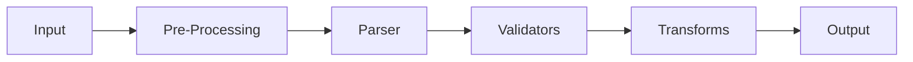
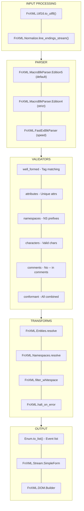

# Getting Started with FnXML

A composable, streaming XML parser for Elixir with modular validation components.

## Installation

Add `fnxml` to your dependencies in `mix.exs`:

```elixir
def deps do
  [
    {:fnxml, "~> 1.0"}
  ]
end
```

Then run:

```bash
mix deps.get
```

---

## Quick Start

### Parse XML to Events

```elixir
xml = """
<?xml version="1.0"?>
<book id="123">
  <title>Elixir in Action</title>
  <author>Sasa Juric</author>
</book>
"""

events = FnXML.parse_stream(xml) |> Enum.to_list()
```

This produces a list of events:

```elixir
[
  {:prolog, "xml", [{"version", "1.0"}], 1, 0, 1},
  {:start_element, "book", [{"id", "123"}], 2, 22, 23},
  {:space, "\n  ", 2, 22, 36},
  {:start_element, "title", [], 3, 39, 40},
  {:characters, "Elixir in Action", 3, 39, 47},
  {:end_element, "title", 3, 39, 63},
  # ... more events
]
```

### Parse with Validation

```elixir
xml
|> FnXML.parse_stream()
|> FnXML.Validate.well_formed()
|> FnXML.Validate.attributes()
|> Enum.to_list()
```

### Parse Large Files (Streaming)

```elixir
File.stream!("large.xml", [], 64_000)
|> FnXML.MacroBlkParser.Edition5.stream()
|> Stream.filter(&match?({:start_element, "item", _, _, _, _}, &1))
|> Enum.each(&process_item/1)
```

---

## Core Concepts

### Event-Based Parsing

FnXML is a SAX-style parser that emits events as it processes XML. This allows:

- **Memory efficiency**: Process gigabyte files without loading them into memory
- **Early termination**: Stop parsing when you find what you need
- **Composable pipelines**: Chain validators and transforms using Elixir streams

### Event Types

| Event | Format | Description |
|-------|--------|-------------|
| `:prolog` | `{:prolog, "xml", attrs, line, ls, pos}` | XML declaration |
| `:start_element` | `{:start_element, tag, attrs, line, ls, pos}` | Opening tag |
| `:end_element` | `{:end_element, tag, line, ls, pos}` | Closing tag |
| `:characters` | `{:characters, text, line, ls, pos}` | Text content |
| `:space` | `{:space, whitespace, line, ls, pos}` | Whitespace-only text |
| `:cdata` | `{:cdata, content, line, ls, pos}` | CDATA section |
| `:comment` | `{:comment, content, line, ls, pos}` | XML comment |
| `:processing_instruction` | `{:processing_instruction, target, content, line, ls, pos}` | PI like `<?target content?>` |
| `:dtd` | `{:dtd, content, line, ls, pos}` | DOCTYPE declaration |
| `:error` | `{:error, type, message, line, ls, pos}` | Parse error |

Position fields: `line` (1-indexed), `ls` (line start byte offset), `pos` (absolute byte offset)

---

## Architecture Overview



FnXML processes XML through composable stream pipelines. Each component is independent and can be included, excluded, or replaced based on your needs.

---

## Parsers

### MacroBlkParser (Recommended)

The primary parser, available in two XML specification editions:

| Module | Description |
|--------|-------------|
| `FnXML.MacroBlkParser.Edition5` | XML 1.0 Fifth Edition (default, permissive Unicode) |
| `FnXML.MacroBlkParser.Edition4` | XML 1.0 Fourth Edition (stricter character validation) |

```elixir
# High-level API (uses Edition 5)
FnXML.parse_stream(xml_string)

# Direct access (fastest)
[xml_string]
|> FnXML.MacroBlkParser.Edition5.stream()
|> Enum.to_list()

# Edition 4 for strict validation
[xml_string]
|> FnXML.MacroBlkParser.Edition4.stream()
|> Enum.to_list()

# Dynamic edition selection
FnXML.MacroBlkParser.parser(5).stream([xml_string])
```

### Legacy Parsers

| Parser | Use Case |
|--------|----------|
| `FnXML.FastExBlkParser` | Maximum speed (no position tracking, no whitespace events) |
| `FnXML.ExBlkParser` | Full features with Edition 5 character rules |

```elixir
# Fastest option (no positions, skips inter-element whitespace)
[xml] |> FnXML.FastExBlkParser.stream() |> Enum.to_list()
```

---

## Validators

Validators are stream transforms that check XML constraints. Chain them as needed:

```elixir
stream
|> FnXML.Validate.well_formed()      # Tag matching
|> FnXML.Validate.attributes()       # Unique attribute names
|> FnXML.Validate.namespaces()       # Namespace prefix declarations
|> FnXML.Validate.characters()       # Valid XML characters
|> FnXML.Validate.comments()         # No -- in comments
```

### Available Validators

| Function | Validates | Cost |
|----------|-----------|------|
| `well_formed/2` | Tag matching (open/close) | Low |
| `attributes/2` | Unique attribute names | Low |
| `namespaces/2` | Namespace prefix declarations | Medium |
| `characters/2` | Valid XML characters | Medium |
| `comments/2` | No `--` in comments | Low |
| `processing_instructions/2` | Valid PI targets | Low |
| `root_boundary/2` | Content within root element | Low |
| `entity_references/2` | Defined entity names | Low |
| `character_references/2` | Valid character references | Low |
| `xml_declaration/2` | XML declaration syntax | Low |
| `attribute_values/2` | No `<` in attribute values | Low |
| `conformant/2` | **All of the above combined** | High |

### Error Handling Options

All validators accept an `:on_error` option:

```elixir
# Raise exception (default)
stream |> FnXML.Validate.well_formed(on_error: :raise)

# Emit error event in stream
stream |> FnXML.Validate.well_formed(on_error: :emit)

# Skip invalid elements silently
stream |> FnXML.Validate.well_formed(on_error: :skip)
```

---

## Entity Resolution

Resolve entity references (`&amp;`, `&lt;`, custom entities):

```elixir
stream
|> FnXML.Entities.resolve(
  entities: %{"custom" => "replacement"},  # Custom entity definitions
  on_unknown: :keep,                        # :raise | :emit | :keep | :remove
  edition: 5                                # For re-parsing entity markup
)
```

Built-in entities: `&amp;` `&lt;` `&gt;` `&quot;` `&apos;`

---

## Namespace Processing

Three modes of namespace handling:

```elixir
# Validate only (check prefixes are declared)
stream |> FnXML.Namespaces.validate()

# Resolve to expanded names {local_name, namespace_uri}
stream |> FnXML.Namespaces.resolve()

# Both validate and resolve
stream |> FnXML.Namespaces.process()
```

---

## Pre-Processing

### Line Ending Normalization

Convert `\r\n` and `\r` to `\n` per XML spec:

```elixir
chunks
|> FnXML.Normalize.line_endings_stream()
|> FnXML.MacroBlkParser.Edition5.stream()
```

### UTF-16 Conversion

Handle UTF-16 encoded documents:

```elixir
binary_data
|> then(&[&1])
|> FnXML.Utf16.to_utf8()
|> FnXML.MacroBlkParser.Edition5.stream()
```

---

## Output Formats

### Event List (Default)

```elixir
events = stream |> Enum.to_list()
```

### Simple Form (Saxy-compatible)

```elixir
events
|> FnXML.Stream.SimpleForm.transform()
|> Enum.to_list()
# => [{:start_element, {"", "root"}, []}, ...]
```

### DOM Tree

```elixir
events
|> FnXML.DOM.Builder.build()
# => {:ok, %{tag: "root", attrs: [], children: [...]}}
```

---

## Utility Functions

```elixir
# Stop on first error
stream |> FnXML.halt_on_error() |> Enum.to_list()

# Filter whitespace between elements
stream |> FnXML.filter_whitespace() |> Enum.to_list()

# Extract only opening tags
stream |> FnXML.open_tags() |> Enum.map(&elem(&1, 1))

# Extract text content
stream |> FnXML.text_content() |> Enum.join("")

# Check for errors in collected events
case FnXML.check_errors(events) do
  {:ok, events} -> process(events)
  {:error, errors} -> handle_errors(errors)
end
```

---

## Common Patterns

### Configuration File Parser

Trusted, simple XML:

```elixir
defmodule ConfigParser do
  def parse(xml) do
    xml
    |> then(&[&1])
    |> FnXML.MacroBlkParser.Edition5.stream()
    |> FnXML.Validate.well_formed()
    |> FnXML.Entities.resolve()
    |> FnXML.filter_whitespace()
    |> Enum.to_list()
  end
end
```

### SOAP/XML-RPC Parser

Namespace-aware with validation:

```elixir
defmodule SoapParser do
  def parse(xml) do
    xml
    |> FnXML.parse_stream()
    |> FnXML.Validate.well_formed()
    |> FnXML.Validate.attributes()
    |> FnXML.Validate.namespaces()
    |> FnXML.Namespaces.resolve()
    |> FnXML.Entities.resolve()
    |> Enum.to_list()
  end
end
```

### Secure Parser for Untrusted Input

Maximum validation:

```elixir
defmodule SecureParser do
  def parse(xml) do
    xml
    |> then(&[&1])
    |> FnXML.Utf16.to_utf8()
    |> FnXML.Normalize.line_endings_stream()
    |> FnXML.MacroBlkParser.Edition5.stream()
    |> FnXML.Validate.conformant(on_error: :emit)
    |> FnXML.Entities.resolve(on_unknown: :emit)
    |> FnXML.halt_on_error()
    |> Enum.to_list()
    |> FnXML.check_errors()
  end
end
```

### Large File Processor

Memory-efficient streaming:

```elixir
defmodule LargeFileParser do
  def stream_elements(path, target_tag) do
    File.stream!(path, [], 64_000)
    |> FnXML.MacroBlkParser.Edition5.stream()
    |> Stream.filter(fn
      {:start_element, ^target_tag, _, _, _, _} -> true
      _ -> false
    end)
  end

  def count_elements(path) do
    File.stream!(path, [], 64_000)
    |> FnXML.MacroBlkParser.Edition5.stream()
    |> Stream.filter(&match?({:start_element, _, _, _, _, _}, &1))
    |> Enum.count()
  end
end
```

### DTD-Aware Parser

With entity definitions from DTD:

```elixir
defmodule DtdAwareParser do
  def parse(xml, dtd_path) do
    {:ok, dtd_content} = File.read(dtd_path)
    {:ok, dtd_model} = FnXML.DTD.Parser.parse(dtd_content)

    entities =
      dtd_model.entities
      |> Enum.filter(fn {_, v} -> match?({:internal, _}, v) end)
      |> Enum.map(fn {name, {:internal, value}} -> {name, value} end)
      |> Map.new()

    xml
    |> FnXML.parse_stream()
    |> FnXML.Validate.well_formed()
    |> FnXML.Entities.resolve(entities: entities)
    |> Enum.to_list()
  end
end
```

---

## Performance Optimization

### Skip Unnecessary Components

| Component | Skip When | Savings |
|-----------|-----------|---------|
| `FnXML.Utf16.to_utf8()` | Input is UTF-8 | ~5-10% |
| `FnXML.Normalize.line_endings_stream()` | Unix line endings | ~2-5% |
| `FnXML.Validate.characters()` | Trusted input | ~10-15% |
| `FnXML.Validate.namespaces()` | No namespaces used | ~5-10% |
| `FnXML.Validate.comments()` | Don't care about comments | ~1-2% |
| `FnXML.Entities.resolve()` | No entities in document | ~5-10% |
| All validators | Trusted, validated input | ~30-50% |

### Choose the Right Parser

```elixir
# Maximum performance (no positions, no whitespace events)
[xml] |> FnXML.FastExBlkParser.stream() |> Enum.to_list()

# Standard parsing with Edition 5 (recommended)
[xml] |> FnXML.MacroBlkParser.Edition5.stream() |> Enum.to_list()

# Strict character validation (Edition 4)
[xml] |> FnXML.MacroBlkParser.Edition4.stream() |> Enum.to_list()
```

### Use Lazy Evaluation

```elixir
# Stop after finding first match
FnXML.parse_stream(large_xml)
|> Stream.filter(&match?({:start_element, "target", _, _, _, _}, &1))
|> Enum.take(1)
```

### Character Validation Performance

For tight loops, use direct functions:

```elixir
# Slower (option dispatch)
Enum.all?(chars, &FnXML.Char.name_start_char?(&1, edition: 5))

# Faster (direct function)
Enum.all?(chars, &FnXML.Char.name_start_char_ed5?/1)

# Fastest (capture once, reuse)
{start?, _char?, _valid?} = FnXML.Char.validators(5)
Enum.all?(chars, start?)
```

---

## Component Summary



---

## DTD Processing

### Parse DTD

```elixir
FnXML.DTD.Parser.parse(dtd_string, edition: 5)
# => {:ok, %FnXML.DTD.Model{elements: %{}, entities: %{}, ...}}
```

### Fetch External DTD

```elixir
{:ok, content} = FnXML.ExternalResolver.fetch("schema.dtd", "/base/path.xml")
{:ok, model} = FnXML.ExternalResolver.parse_external_dtd(content, edition: 5)
```

---

## Character Validation

Edition-aware validation for XML Names:

```elixir
# Check single characters
FnXML.Char.name_start_char?(codepoint, edition: 5)
FnXML.Char.name_char?(codepoint, edition: 4)

# Validate complete names
FnXML.Char.valid_name?("element-name", edition: 5)

# Direct functions (faster, no option dispatch)
FnXML.Char.name_start_char_ed5?(codepoint)
FnXML.Char.name_char_ed4?(codepoint)
FnXML.Char.valid_name_ed5?(name)
```

---

## Error Handling

### Collecting Errors

```elixir
events =
  xml
  |> FnXML.parse_stream()
  |> FnXML.Validate.well_formed(on_error: :emit)
  |> Enum.to_list()

errors = Enum.filter(events, &match?({:error, _, _, _, _, _}, &1))
```

### Stop on First Error

```elixir
result =
  xml
  |> FnXML.parse_stream()
  |> FnXML.Validate.conformant(on_error: :emit)
  |> FnXML.halt_on_error()
  |> Enum.to_list()
  |> FnXML.check_errors()

case result do
  {:ok, events} -> {:ok, events}
  {:error, errors} -> {:error, hd(errors)}
end
```

---

## Next Steps

- Check out the [test suite](test/) for more usage examples
- Run benchmarks with `mix run bench/parse_bench.exs`
- See `FnXML` module docs for the complete API reference
